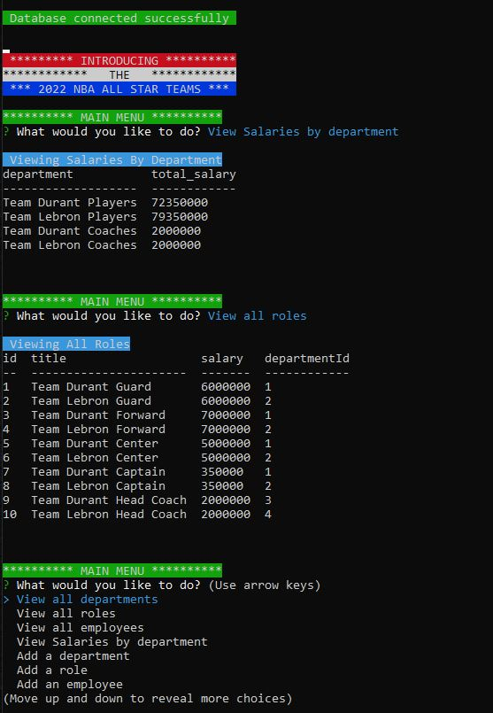
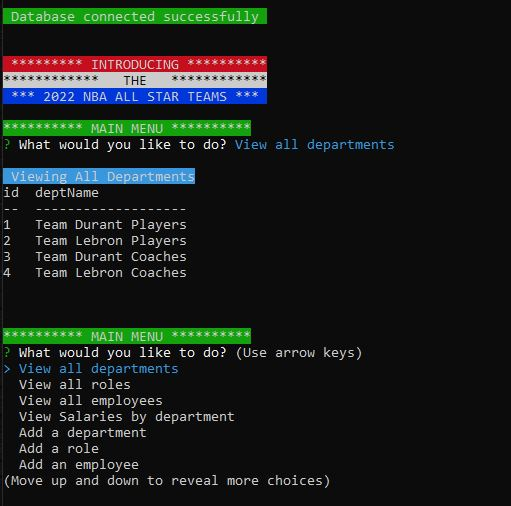

# 2022_nba_all_star_team_employee_tracker     
Your assignment this week is to build a command-line application from scratch to manage a company's employee database, using Node.js, Inquirer, and MySQL.
 

## Description
This is a command line application that can display a list of employees, their roles and departments.  There is the ability to add and delete these also.
 

## Table of Contents
- [Installation](#installation)
- [Usage](#usage)
- [Questions](#questions)
- [Contributing](#contributing)
- [License](#license)
 

## Installation
You must have node.js installed on your system. 
You can run [npm install] to install all the required npm packages. 
The packages that will be imported are:
     &emsp;1) MYSQL2
     &emsp;2) INQUIRER
     &emsp;3) CONSOLE.TABLE
     &emsp;4) DOTENV
     &emsp;5) CHALK
 

## Usage
To start the program, open the command terminal from the root directory.
Type [npm start].  This will run the script file that executes the command [node server.js]
Once the program loads, you will be presented with the main menu and can view, add, or delete as you wish.
 
 
A demo of the application can be viewed here:
 
https://github.com/jk377y/2022-nba-all-stars-employee-tracker
 

The source code for the application can be viewed here:
 
https://github.com/jk377y/2022-nba-all-stars-employee-tracker

 
Here are a few images of the application running from the terminal window:
 
Screenshot of deployed application showing the employee list:
 

 
Screenshot of deployed application showing the salaries by department and roles list:
 

 
Screenshot of deployed application showing the department list:
 

 

## Questions
For Questions, I can be reached at the following:
 GitHub:  https://github.com/jk377y
 OR
 Email:  jk377y@gmail.com
 

## Contributing
FABIEN MORENO @ https://www.linkedin.com/in/fabien-moreno/
For collaboration, ideas and assistance.
 
STEFAN MISCHOOK @ https://www.youtube.com/c/StefanMischook for walkthroughs and explanation of JavaScript functions and tutoring.
 
MOSH HAMEDANI @ https://www.codewithmosh.com for instructional videos on relavent topics.
 
NPM - https://www.npmjs.com/ (for research and documentation referencing)
 
INQUIRER NPM package - https://www.npmjs.com/package/inquirer (for research and documentation referencing)
 
MYSQL2 NPM package - https://www.npmjs.com/package/mysql2 (for research and documentation referencing)
 
CONSOLE.TABLE NPM package - https://www.npmjs.com/package/console.table (for research and documentation referencing)
 
DOTENV NPM package - https://www.npmjs.com/package/dotenv (for research and documentation referencing)
 
CHALK NPM package - https://www.npmjs.com/package/chalk (for research and documentation referencing)
 
You also can help support me by donating with 💵Cash App💵 @ 💵$JK377Y💵
  

## License

 Copyright (c) 2023 James Kelly
 Information on this license can be found at: (https://opensource.org/licenses/MIT)